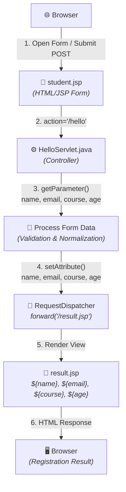

# JSP & Servlet Architecture - Step-by-Step Implementation Guide

This project demonstrates the **Model-View-Controller (MVC / Model-2)** architecture using **Java Servlets** and **JavaServer Pages (JSP)** running on **Apache Tomcat**.

---

## 📂 Project Directory Structure

```
JSP/
├── pom.xml                               # Maven project configuration
├── README.md                             # Step-by-step instructions
└── src/
    └── main/
        ├── java/
        │   └── com/
        │       └── servlet/
        │           ├── App.java            # Main Runner (Instant VS Code Run)
        │           └── HelloServlet.java   # Controller Layer Servlet
        └── webapp/
            ├── WEB-INF/
            │   └── web.xml                     # Deployment Descriptor
            ├── student.jsp                     # Student Registration View
            └── result.jsp                      # Presentation / View Layer
```

---

## 🔄 Step-by-Step Request Lifecycle Walkthrough



1. **Step 1: User Input via Browser (Client Tier)**
   - The user loads [student.jsp](file:///c:/Users/jains/Videos/java%20tutorial/JSP/src/main/webapp/student.jsp) and fills out the student details (`Name`, `Email`, `Course`, `Age`).
   - Clicking **Register** submits an HTTP `POST` request to the servlet url `/hello`.

2. **Step 2: Controller Processing ([HelloServlet.java](file:///c:/Users/jains/Videos/java%20tutorial/JSP/src/main/java/com/servlet/HelloServlet.java))**
   - The Tomcat container maps `/hello` to `com.servlet.HelloServlet`.
   - `request.getParameter("name")`, `request.getParameter("email")`, `request.getParameter("course")`, `request.getParameter("age")` extract the form inputs.
   - Values are stored into request attributes:
     - `request.setAttribute("name", name)`
     - `request.setAttribute("email", email)`
     - `request.setAttribute("course", course)`
     - `request.setAttribute("age", ageStr)`

3. **Step 3: Internal Server Forwarding & JSP Execution ([result.jsp](file:///c:/Users/jains/Videos/java%20tutorial/JSP/src/main/webapp/result.jsp))**
   - `request.getRequestDispatcher("/result.jsp").forward(request, response)` transfers execution to the JSP view internally on the server (preserving request attributes and keeping the URL intact).
   - Tomcat's JSP engine evaluates Expression Language (EL) tags (`${name}`, `${email}`, `${course}`, `${age}`) and renders dynamic HTML.

4. **Step 4: HTML Response to Client**
   - The generated pure HTML page is sent back to the browser with status `200 OK`.

---

## 🚀 How to Run the Project

### Option 1: Instant Run via `App.java` (Inside VS Code / Eclipse / IntelliJ)
1. Open [App.java](file:///c:/Users/jains/Videos/java%20tutorial/JSP/src/main/java/com/servlet/App.java).
2. Click **Run** or press **F5** (or run `java com.servlet.App`).
3. An embedded server starts at `http://localhost:8080/`.
4. Your browser will automatically open `student.jsp`. Submit the form and see the dynamic output immediately!

---

### Option 2: Using Eclipse IDE (with Apache Tomcat Server)
1. Open Eclipse &rarr; **File** &rarr; **Import** &rarr; **Existing Maven Projects** &rarr; Select the `JSP` project folder.
2. Configure Tomcat Server in Eclipse:
   - Go to the **Servers** tab &rarr; Click **New Server** &rarr; Choose **Apache Tomcat v10.1+**.
   - Browse to your Tomcat installation directory and click **Finish**.
3. Right-click the project &rarr; **Run As** &rarr; **Run on Server**.
4. Access: `http://localhost:8080/servlet/`

---

### Option 3: Using IntelliJ IDEA (Ultimate)
1. Open IntelliJ &rarr; **Open** &rarr; Select the `pom.xml` file.
2. Go to **Run** &rarr; **Edit Configurations...** &rarr; **+** &rarr; **Tomcat Server** &rarr; **Local**.
3. In the **Deployment** tab, click **+** &rarr; **Artifact** &rarr; Select `servlet:war exploded`.
4. Set Application context to `/` or `/servlet`.
5. Click **Run** / **Debug**.
6. Access: `http://localhost:8080/servlet/`

---

### Option 4: Standalone Apache Tomcat (Manual Deployment)
1. Build the `.war` package using Maven:
   ```bash
   mvn clean package
   ```
2. Copy the generated `target/servlet.war` file to the Tomcat `webapps` folder:
   ```bash
   copy target\servlet.war "C:\path\to\apache-tomcat\webapps\"
   ```
3. Start Tomcat using `bin\startup.bat`.
4. Open your browser and navigate to:
   ```
   http://localhost:8080/servlet/
   ```

---

## 💡 Important Notes on Tomcat & Package Names

- **Tomcat 10+ / Jakarta EE 9+**: Uses `jakarta.servlet.*` package imports (as configured in this project).
- **Tomcat 9 or older / Java EE 8**: Uses `javax.servlet.*` package imports. If using Tomcat 9, change `jakarta.*` imports in [HelloServlet.java](file:///c:/Users/jains/Videos/java%20tutorial/JSP/src/main/java/com/servlet/HelloServlet.java) to `javax.*`.
